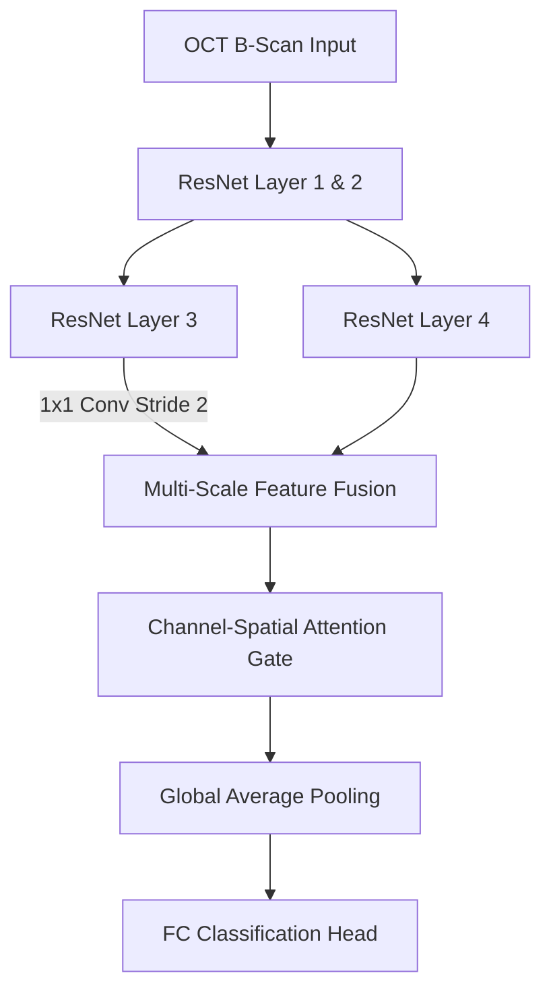

# Attention-Enhanced ResNet with Multi-Scale Feature Fusion for Retinal OCT Classification

A PyTorch research pipeline for classifying retinal diseases from Optical Coherence Tomography (OCT) images. The architecture proposes a lightweight **Attention-Enhanced ResNet (AE-ResNet)** that integrates Multi-Scale Feature Fusion and a selective Channel-Spatial Attention (CSA) gate.

In addition to classification, the codebase implements a comprehensive **Trustworthy AI evaluation framework** analyzing quantitative explainability, model calibration, and robustness to cross-scanner domain shift.

---

## 🛠️ System Architecture

The pipeline processes raw B-scans and routes them through a targeted feature fusion and gating mechanism:



---

## 🌟 Core Research Components

### 1. Preprocessing & Augmentation (`src/preprocessing/`)
* **Standardized Transforms**: Image resizing, normalization, and conversion to tensor.
* **Patient-Level Isolation**: Prevents data leakage by ensuring all scans of a given patient reside strictly in either the training, validation, or test set.
* **Imbalance Sampling**: Uses a `WeightedRandomSampler` with inverse class frequency weights to handle severe pathology imbalance.

### 2. AE-ResNet Architecture (`src/models/ae_resnet.py`)
* **Multi-Scale Fusion**: Downsamples and projects ResNet Layer 3 features to fuse structural and spatial details directly with the deep semantic features of Layer 4.
* **CSA Attention Gating**: Calibrates channel importance and spatial focus sequentially before global pooling to highlight pathologic biomarkers (e.g., fluid pockets, drusen).

### 3. Trustworthy AI Evaluation Framework
* **Quantitative XAI**: Employs LayerCAM with validation metrics including **Saliency Entropy** (explanation sharpness) and the **Area Over the Perturbation Curve (AOPC)** (explanation faithfulness).
* **Calibration Metrics**: Evaluates model confidence alignment using **Expected Calibration Error (ECE)** and Brier scores.
* **Generalization Testing**: Evaluates out-of-domain transfer on the external `OCTID` dataset.

---

## 🚀 Quickstart Guide

### Setup Environment
```bash
# Clone the repository
git clone https://github.com/Gnanapravallika/retinal-oct-diagnostics.git
cd retinal-oct-diagnostics

# Install dependencies
pip install -r requirements.txt
```

### Train the Model
To start training the AE-ResNet or baseline architectures on your dataset:
```python
from src.training.trainer import train_model

# Train the proposed AE-ResNet model
train_model(
    model_name="ae-resnet",
    csv_path="path/to/dataset_mapping.csv",
    epochs=40,
    batch_size=16
)
```

Supported baselines for training: `ae-resnet`, `resnet50`, `densenet121`, `efficientnet-b0`.

---

## 📊 Evaluation and Statistics
* **Explainability Audit**: Evaluates saliency faithfulness over the test set, outputting AOPC and Saliency Entropy.
* **Calibration Audit**: Computes ECE and Brier scores for confidence metrics.
* **Statistical Tests**: Includes scripts for Wilcoxon signed-rank tests and McNemar's tests to prove statistical significance.
